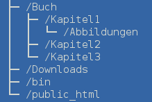

# Einführung in die Benutzung von Linux

Im Rahmen der Vorlesung _Rechnerarchitektur und Rechnernetze_ am
Lehrstuhl für Angewandte Informatik II  
Universität Bayreuth  
Wintersemester 2013/14

## Linux?

- Linux bezeichnet eigentlich nur den Betriebssystem-Kernel
- Kernel + System- und Anwenderprogramme = vollständiges Betriebssystem für
  Endanwender (Distribution)
- Es gibt zahllose Distributionen, zu viele, um sie alle aufzuzählen
- Aktuelle Spitzenplätze auf [distrowatch.com](http://distrowatch.com)
  (Oktober 2013): 1. [Mint](http://www.linuxmint.com), 2.
  [Debian](http://www.debian.org/), 3. [Ubuntu](http://www.ubuntu.com/)
- Weitere bekannte Distributionen: [Fedora](http://fedoraproject.org),
  [openSUSE](http://de.opensuse.org), [Mageia](http://www.mageia.org),
  [Gentoo](http://www.gentoo.org), ...
- Linux ist weit verbreitet, vor allem auf Servern, Supercomputern, in
  eingebetteten Systemen, auf Smartphones und auf Tablets (Android)
- Desktop-Umgebungen wie [KDE](http://www.kde.org),
  [GNOME](http://www.gnome.org), [Xfce](http://www.xfce.org) oder
  [LXDE](http://lxde.org) bieten grafische Benutzeroberflächen und erleichtern
  den Einstieg

## $HOME sweet $HOME

- Linux ist ein Mehrbenutzer-Betriebssystem
- Jeder Benutzer hat ein eigenes Arbeitsverzeichnis (Home-Verzeichnis)
- Dateien und Verzeichnisse außerhalb des eigenen Home-Verzeichnisses können
  nur mit entsprechenden Rechten zugegriffen werden

### Beispiel

_Anlegen und Löschen von Ordnern und Dateien in der aktuellen
Desktop-Umgebung_

## Die Kommandozeile

- Die Kommandozeile bietet Zugriff auf grafische und nichtgrafische Tools
  und Anwendungen; man gibt Befehle ein und bestätigt mit der Eingabetaste
- `man xyz` (manual) liefert Hilfe zu einem bestimmten Befehl `xyz`
- Alles, was folgt, funktioniert auch auf Macs, da OS X und Linux ein
  gemeinsames Vorbild haben: [Unix](http://de.wikipedia.org/wiki/Unix)

### Beispiel

_Anlegen und Löschen von Ordnern und Dateien in der Kommandozeile_

Wo befinden wir uns?

`pwd` (print working directory)

Wir befinden uns in unserem Home-Verzeichnis. Was gibt es hier?

`ls` (list contents)

Noch nicht besonders viel. Es kann losgehen:

1. `mkdir Buch` (make directory)
2. `cd Buch` (change directory)

	Wir befinden uns jetzt im Verzeichnis `Buch`, das wir soeben angelegt
	haben.  Die restlichen fehlenden Verzeichnisse können wir der Reihe nach
	oder in einem Rutsch erstellen.

3. `mkdir Kapitel1 Kapitel1/Abbildungen Kapitel2 Kapitel3`
4. `cd Kapitel1`

	Jetzt befinden wir uns in `Kapitel1`, einem Unterverzeichnis von `Buch`.
	Tilde (`~`) bezeichnet unser Home-Verzeichnis (Neugierige probieren `echo
	~`). Wir kopieren die Datei `tux.png` von `Downloads` nach `Abbildungen`.
	Mit `echo` erzeugen wir die Datei `01_Einleitung.txt` und fügen eine erste
	Zeile Text ein.  Da wir uns in `Buch/Kapitel1` befinden, bringt uns `cd
	..` in das übergeordnete Verzeichnis `Buch` zurück.

5. `cp ~/Downloads/tux.png Abbildungen` (copy)
6. `echo "## Einleitung" > 01_Einleitung.txt`
7. `cd ..`

	Wir kopieren nun alle Bilder mit der Endung `tif` von `Downloads` ins
	aktuelle Verzeichnis (`Buch`). Mit `echo` erzeugen wir analog zu 6. die
	Datei `Inhalt.txt`. Fertig!

8. `cp ~/Downloads/*.tif .`
9. `echo "# Titel" > Inhalt.txt`

Das war recht mühsam. Schön wäre es, wenn man diesen Vorgang automatisieren
könnte...

### Ein einfaches Shell-Skript

_Shell = Kommandozeileninterpreter_

Um alle Befehle aus unserem Beispiel "auf einmal" auszuführen, erstellen wir
eine Datei `newbook.sh` mit folgendem Inhalt:

	mkdir Buch
	cd Buch
	mkdir Kapitel1 Kapitel1/Abbildungen Kapitel2 Kapitel3
	cd Kapitel1
	cp ~/Downloads/tux.png Abbildungen
	echo "## Einleitung" > 01_Einleitung.txt
	cd ..
	cp ~/Downloads/*.tif .
	echo "# Titel" > Inhalt.txt

Können wir die Datei nun als Programm ausführen? Noch nicht...

`ls -l`

Die Datei `newbook.sh` kann zwar gelesen und verändert, aber nicht ausgeführt
werden. Das müssen wir ändern.

`chmod +x newbook.sh` (change mode)  
`ls -l`

Et voilà! Mit `mv` verschieben wir `newbook.sh` nach `bin` und mit `cd` ohne
Pfadangabe wechseln wir direkt ins Home-Verzeichnis.

`mv newbook.sh ~/bin` (move)  
`cd` 

 Zum Test löschen wir unser oben angelegtes `Buch`. Bereit? Dann los:

`newbook.sh`

### Zum Schluss

Kommandos lassen sich verketten: `a | b` bedeutet, die Ausgabe bzw. das
Ergebnis von `a` wird als Eingabe von `b` verwendet. Extrem nützlich! Drei
kurze Beispiele:

`find -name '*.txt' | wc -l` ermittelt die Anzahl der Textdateien im
aktuellen Verzeichnis einschließlich aller Unterverzeichnisse.

`echo "4/3 * 3.14159 * 2.25^3" | bc` bestimmt den Wert des in Klammern
stehenden arithmetischen Ausdrucks (`bc` ist ein Taschenrechner).

`history | tr -s " " | cut -d" " -f3 | sort | uniq -c | sort -nr | head` zeigt
die "Top 10" der am häufigsten benutzten Kommandos. 

Das letzte Beispiel lässt erahnen, der Fantasie sind nahezu keine Grenzen
gesetzt.
