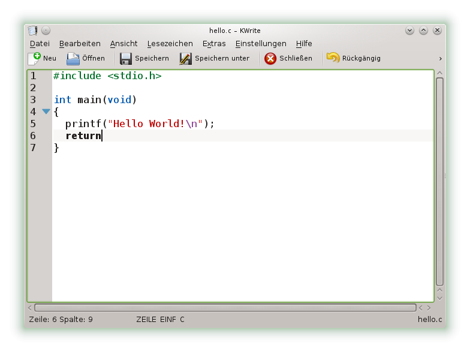
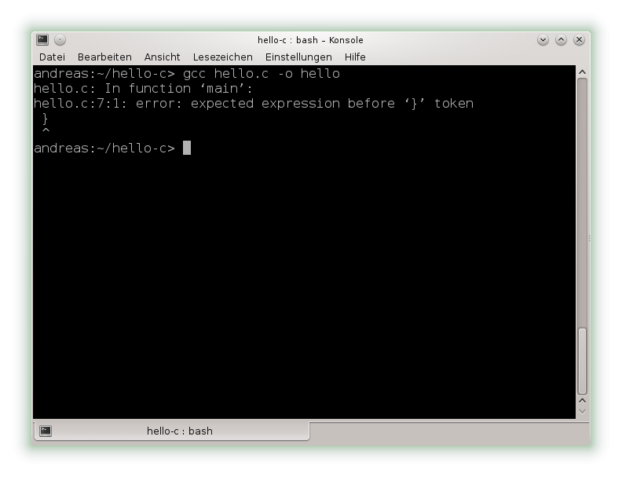
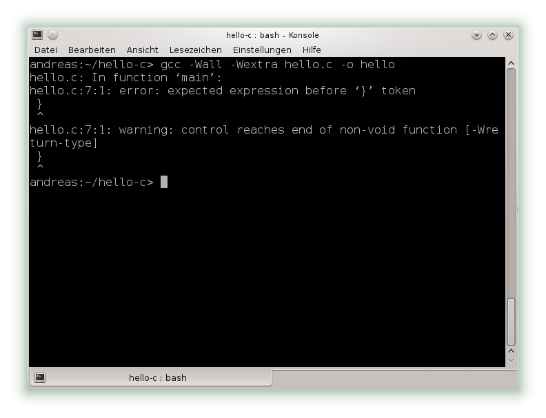

# Hello C

## Ein erstes Programm

Linux bietet eine Vielzahl von Texteditoren und Entwicklungsumgebungen
unterschiedlichen Umfangs. Als Beispiel öffnen wir KWrite, einen einfachen
Texteditor der [KDE](http://www.kde.org)-Arbeitsumgebung. KWrite finden wir
unter `Anwendungen > Dienstprogramme > Editor`.

Nach dem Öffnen speichern wir eine noch leere Datei als `hello.c` in einem
Unterordner unserer Wahl.

Bevor wir nun unser erstes Programm abtippen, lohnt es sich ein paar
Einstellungen vorzunehmen. Zeilennummerierung und Syntaxhervorhebung erweisen
sich als besonders nützlich im Umgang mit Quelltexten. Wir setzen den Haken bei
`Ansicht > Zeilennummern anzeigen` und vergewissern uns, dass `Extras >
Hervorhebung > Quelltexte > C` aktiv ist. Unter `Einstellungen > Editor
einrichten ...` können wir Änderungen permanent beibehalten. Ein weiteres
Hilfsmittel ist zum Beispiel das Auto-Klammern, zu finden unter `Einstellungen
> Editor einrichten ... > Erweiterungen`.

Nachdem wir den Editor nach unseren Vorstellungen eingerichtet haben, kann es
losgehen (nicht vergessen, regelmäßig speichern).

## Die Kommandozeile

Um unser Programm ausführen zu können, muss es in Maschinenbefehle übersetzt
werden. Dazu öffnen wir eine Konsole. Bei KDE zum Beispiel finden wir diese
unter `Anwendungen > System > Terminal`.

Die Konsole erwartet Befehle, die wir eingeben und mit Enter bestätigen.

Anfangs befinden wir uns in unserem Home-Verzeichnis. Um in ein anderes
Verzeichnis zu wechseln, benutzen wir `cd` (change directory). Gut zu wissen:
Mit `cd ..` wechseln wir ins übergeordnete Verzeichnis, mit `cd` ohne Angabe
eines Pfades landen wir wieder in unserem Home-Verzeichnis. Der Inhalt eines
Verzeichnisses lässt sich mit `ls` (list contents) anzeigen.

Nachdem wir in das Verzeichnis gewechselt sind, in dem sich unsere
C-Quelldatei `hello.c` befindet (hier `hello-c`), rufen wir den Compiler zur
Übersetzung auf: `gcc hello.c` erzeugt standardmäßig eine ausführbare Datei
mit dem Namen `a.out`.

Möchten wir, dass unser Programm einen anderen Namen trägt, müssen wir diesen
beim Übersetzen mit der Option `-o` angeben: `gcc hello.c -o hello` liefert
eine ausführbare Datei mit dem Namen `hello`. Auf eine Dateiendung können wir
verzichten, da diese bei ausführbaren Dateien unter Linux keine Rolle spielt.

Ausführen können wir unser Programm mit `./hello`, vorausgesetzt, wir befinden
uns im gleichen Verzeichnis. Andernfalls darf die Pfadangabe nicht fehlen.

Wenn wir etwas am Quelltext ändern, muss das Programm erneut übersetzt werden.

Erkennt der Compiler einen schwerwiegenden Fehler, wird die Übersetzung
abgebrochen. Neben Fehlern gibt es Warnungen, die nicht fatal sind, aber auf
potenzielle Probleme hinweisen. Damit uns der Compiler möglichst viele
Hinweise gibt, merken wir uns für die Zukunft, die Optionen `-Wall -Wextra` zu
verwenden. Je mehr Infos, desto besser.

